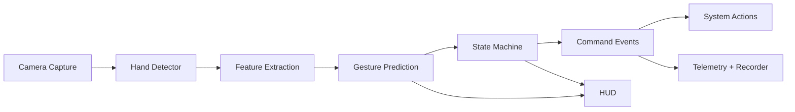

# AGCP MVP Notes

## Runtime architecture

## Demo checklist
- Show lock mode blocks command execution.
- Hold open hand to unlock.
- Hold fist to lock.
- Pinch control adjusts volume continuously with deadzone.
- Two-finger tap triggers play/pause with cooldown.
- Show output logs under `outputs/assistive`.

## Benchmark template
- End-to-end latency p50 / p95:
- Average FPS:
- False triggers per minute:
- Command success rate on scripted run:

